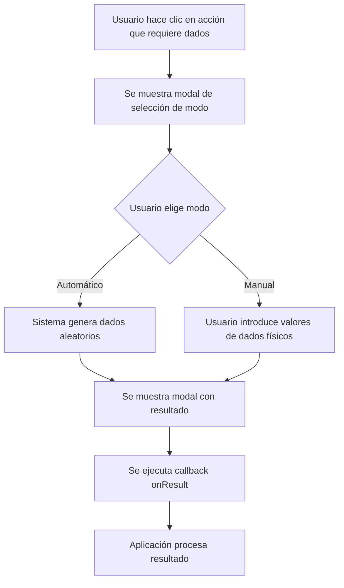

# Sistema Unificado de Dados - DiceRollerUI

## Descripción General

El sistema unificado de dados (`DiceRollerUI`) proporciona una interfaz consistente para todas las tiradas de dados en Spacegom. Garantiza que **todas las tiradas** ofrezcan las opciones de modo manual/automático y muestren los resultados individuales de cada dado.

## Ubicación

- **Código fuente**: [`app/static/js/dice-roller.js`](file:///home/rcruz63/desarrollo/spacegom-web/app/static/js/dice-roller.js)
- **Carga**: En [`app/templates/base.html`](file:///home/rcruz63/desarrollo/spacegom-web/app/templates/base.html#L211) (línea 211)
- **Disponibilidad**: Global en todas las páginas como `window.DiceRollerUI`

## Características

✅ **Modo automático**: El sistema genera los dados aleatoriamente  
✅ **Modo manual**: El jugador introduce resultados de dados físicos  
✅ **Visualización individual**: Muestra cada dado por separado  
✅ **Modificadores opcionales**: Soporta modificadores con nombre  
✅ **UI consistente**: Misma apariencia en toda la aplicación  
✅ **Callbacks asíncronos**: Integración sencilla con APIs  

## Uso Básico

### Sintaxis

```javascript
await DiceRollerUI.requestRoll({
    numDice: 2,              // Número de dados a tirar
    diceSides: 6,            // Caras del dado (default: 6)
    title: "Título",         // Título del modal
    description: "...",      // Descripción opcional
    modifiers: {             // Modificadores opcionales
        "Nombre": valor
    },
    onResult: async (result) => {
        // Callback cuando se obtiene resultado
        // result.dice: array de valores individuales
        // result.sum: suma de dados
        // result.total: suma + modificadores
        // result.mode: 'auto' o 'manual'
    }
});
```

### Objeto `result`

```javascript
{
    dice: [3, 5],           // Valores individuales de cada dado
    sum: 8,                 // Suma de los dados
    mode: 'auto',           // 'auto' o 'manual'
    modifiers: {            // Modificadores aplicados
        "Experiencia": 1,
        "Moral": -1
    },
    total: 8                // sum + suma de modificadores
}
```

## Ejemplos de Uso

### Ejemplo 1: Búsqueda de Personal

**Contexto**: Calcular días de búsqueda para contratar personal.

**Implementación**: [`personnel.html`](file:///home/rcruz63/desarrollo/spacegom-web/app/templates/personnel.html#L393-L448) (líneas 393-448)

```javascript
async function startHireSearch() {
    const experienceModifiers = {
        'Novato': -1,
        'Estándar': 0,
        'Veterano': 1
    };

    await DiceRollerUI.requestRoll({
        numDice: 2,
        diceSides: 6,
        title: "Búsqueda de Personal",
        description: `Calculando días para encontrar ${selectedPosition.name}`,
        modifiers: {
            [selectedLevel]: experienceModifiers[selectedLevel]
        },
        onResult: async (diceResult) => {
            // Enviar resultado al backend
            const formData = new FormData();
            formData.append('position', selectedPosition.name);
            formData.append('experience_level', selectedLevel);
            formData.append('manual_dice_days', diceResult.dice.join(','));
            
            const response = await fetch(`/api/games/${gameId}/hire/start`, {
                method: 'POST',
                body: formData
            });
            
            // Procesar respuesta...
        }
    });
}
```

### Ejemplo 2: Tirada Simple sin Modificadores

```javascript
async function rollForRandomEvent() {
    await DiceRollerUI.requestRoll({
        numDice: 1,
        diceSides: 6,
        title: "Evento Aleatorio",
        description: "¿Qué sucede hoy?",
        onResult: async (result) => {
            if (result.sum >= 4) {
                showToast('¡Evento positivo!', 'success');
            } else {
                showToast('Evento negativo', 'warning');
            }
        }
    });
}
```

### Ejemplo 3: Tirada con Múltiples Modificadores

```javascript
async function combatRoll() {
    await DiceRollerUI.requestRoll({
        numDice: 3,
        diceSides: 6,
        title: "Combate Espacial",
        description: "Resolviendo ataque",
        modifiers: {
            "Habilidad Piloto": 2,
            "Daño en Nave": -1,
            "Bonificación Táctica": 1
        },
        onResult: async (result) => {
            console.log(`Dados: ${result.dice.join(', ')}`);
            console.log(`Suma: ${result.sum}`);
            console.log(`Total con modificadores: ${result.total}`);
            
            // Enviar al backend para resolver combate
            await resolveComat(result);
        }
    });
}
```

## Flujo de Usuario



## Integración con Backend

### Envío de Dados al Backend

Cuando envíes dados al backend, usa el formato de valores separados por comas:

```javascript
formData.append('manual_dice', diceResult.dice.join(','));
// Ejemplo: "3,5" para dados [3, 5]
```

### Recepción en FastAPI

```python
@app.post("/api/some-endpoint")
async def some_endpoint(
    manual_dice: Optional[str] = Form(None)
):
    if manual_dice:
        # Parsear dados manuales
        dice_values = [int(x) for x in manual_dice.split(',')]
    else:
        # Generar dados automáticos
        dice_roller = DiceRoller()
        dice_values = dice_roller.roll_dice(2, 6)
    
    dice_sum = sum(dice_values)
    # Procesar tirada...
```

## API Backend de Dados

### Endpoint: `POST /api/dice/roll`

El sistema puede usar el endpoint del backend para tiradas automáticas:

```javascript
// Llamada automática desde DiceRollerUI.rollAutomatic()
const response = await fetch('/api/dice/roll', {
    method: 'POST',
    headers: { 'Content-Type': 'application/json' },
    body: JSON.stringify({
        num_dice: 2,
        dice_sides: 6
    })
});

const data = await response.json();
// data.dice: [4, 2]
```

## Mejores Prácticas

### ✅ DO (Hacer)

1. **Siempre usar DiceRollerUI** para tiradas de dados (consistencia)
2. **Proporcionar títulos descriptivos** que indiquen el propósito
3. **Usar modificadores con nombres claros** (ej: "Experiencia", no "exp")
4. **Manejar errores** en el callback `onResult`
5. **Enviar dados al backend** en el formato esperado (string separado por comas)

### ❌ DON'T (Evitar)

1. **No generar dados manualmente** con `Math.random()` - usar DiceRollerUI
2. **No saltarse la opción manual** - siempre ofrécela al jugador
3. **No ocultar valores individuales** - mostrar cada dado
4. **No modificar directamente** el código de dice-roller.js
5. **No asumir que el usuario siempre elegirá automático** - soportar ambos modos

## Personalización Visual

Los modales usan las clases CSS globales definidas en `base.html`:

- `glass-panel` - Fondo con efecto cristal
- `tech-border` - Bordes tecnológicos con esquinas
- `neon-blue`, `neon-green` - Colores neón del tema
- `font-orbitron` - Fuente principal
- `bg-space-800` - Fondos oscuros

Para personalizar, modifica estas clases en `base.html` o agrega estilos específicos.

## Troubleshooting

### Problema: "DiceRollerUI is not defined"

**Causa**: Los archivos estáticos no se están sirviendo correctamente.

**Solución**: 
1. Verificar que [`main.py`](file:///home/rcruz63/desarrollo/spacegom-web/app/main.py#L22) tiene la configuración de StaticFiles:
   ```python
   app.mount("/static", StaticFiles(directory="app/static"), name="static")
   ```
2. Verificar que [`base.html`](file:///home/rcruz63/desarrollo/spacegom-web/app/templates/base.html#L211) carga el script:
   ```html
   <script src="/static/js/dice-roller.js"></script>
   ```

### Problema: El callback no se ejecuta

**Causa**: Posible error en el callback que detiene la ejecución.

**Solución**: Envolver el callback en try-catch:

```javascript
onResult: async (result) => {
    try {
        // Tu código aquí
    } catch (error) {
        console.error('Error en callback:', error);
        showToast('Error procesando resultado', 'error');
    }
}
```

## Extensiones Futuras

Posibles mejoras para considerar:

- **Animaciones de dados**: Efecto visual de dados girando
- **Sonidos**: Efectos de audio al tirar dados
- **Historial de tiradas**: Guardar últimas N tiradas
- **Dados especiales**: Soporte para dados de otros tipos (d10, d20, etc.)
- **Dados múltiples diferentes**: Tirar 1d6 + 1d10 simultáneamente

## Mantenimiento

- **Versión actual**: 1.0
- **Última actualización**: 2026-01-11
- **Autor**: Sistema Spacegom
- **Responsable**: Equipo de desarrollo

---

**Resumen**: DiceRollerUI proporciona una experiencia de juego consistente y flexible para todas las tiradas de dados. Úsalo siempre que necesites generar números aleatorios en el contexto del juego.
